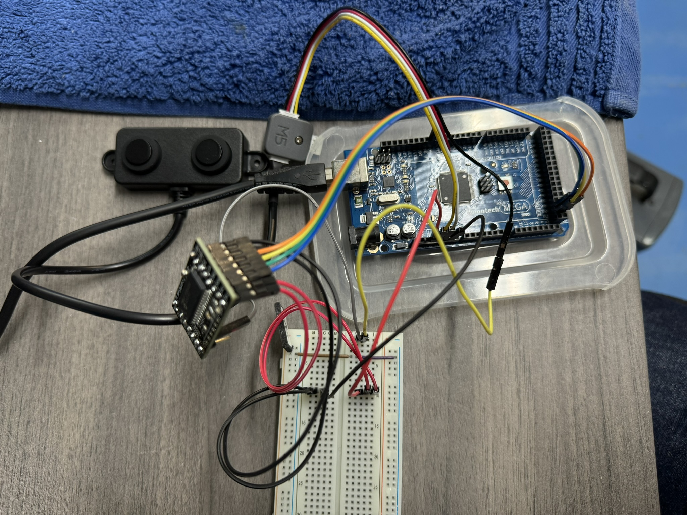

# basics-multiuart
Basic communication from an Arduino with multiple UART devices through an external PIC processor

Arduino Mega 2560 SPI interface pins: 


- CIPO = MISO = 50 = blue
- COPI = MOSI = 51 = green
- SCK = SCK = 52 = yellow
- CS = SS = 53 = orange

Test Setup:



Points of interest:

- The MULTIUART board requires 3.3V power - powering that directly from the 3.3V output on the Arduino Mega was sufficient.
- The sensor is actually running on 5V and the MULTIUART board is happy to accept 3.3V or 5V levels on the UART communication as well as on the SPI side.
- The SPI side of the board is connected directly to the Arduino Mega SPI pins. Again, this is 5V rather than 3.3V.
- The SPI pin naming conventions have changed since this board was created, hence the translation above. Essentially, Master = Controller, Slave = Peripheral.

## First output

```
19: UART 0: 128 bytes: 0x80 0x80 0x03 0x03 0x03 0x03 0x03 0x03 0x03 0x03 0x03 0x03 0x03 0x03 0x03 0x03 0x03 0x03 0x03 0x03 0x03 0x03 0x03 0x03 0x03 0x03 0x03 0x03 0x03 0x03 0x03 0x03 0x03 0x03 0x03 0x03 0x03 0x03 0x03 0x03 0x03 0x03 0x03 0x03 0x03 0x03 0x03 0x03 0x03 0x03 0x03 0x03 0x03 0x03 0x03 0x03 0x03 0x03 0x03 0x03 0x03 0x03 0x03 0x03 0x03 0x03 0x03 0x03 0x03 0x03 0x03 0x03 0x03 0x03 0x03 0x03 0x03 0x03 0x03 0x03 0x03 0x03 0x03 0x03 0x03 0x03 0x03 0x03 0x03 0x03 0x03 0x03 0x03 0x03 0x03 0x03 0x03 0x03 0x03 0x03 0x03 0x03 0x03 0x03 0x03 0x03 0x03 0x03 0x03 0x03 0x03 0x03 0x03 0x03 0x03 0x03 0x03 0x03 0x03 0x03 0x03 0x03 0x03 0x03 0x03 0x03 0x03 0x03
172: UART 0: 3 bytes: 0x03 0x03 0x03
274: UART 0: 3 bytes: 0x03 0x03 0x03
375: UART 0: 3 bytes: 0x03 0x03 0x03
477: UART 0: 3 bytes: 0x03 0x03 0x03
579: UART 0: 3 bytes: 0x03 0x03 0x03
680: UART 0: 3 bytes: 0x03 0x03 0x03
782: UART 0: 3 bytes: 0x03 0x03 0x03
884: UART 0: 3 bytes: 0x03 0x03 0x03
986: UART 0: 3 bytes: 0x03 0x03 0x03
1087: UART 0: 3 bytes: 0x03 0x03 0x03
1189: UART 0: 3 bytes: 0x03 0x03 0x03
1291: UART 0: 3 bytes: 0x03 0x03 0x03
1392: UART 0: 3 bytes: 0x03 0x03 0x03
1495: UART 0: 3 bytes: 0x03 0x03 0x03
1596: UART 0: 3 bytes: 0x03 0x03 0x03
1697: UART 0: 3 bytes: 0x03 0x03 0x03
1800: UART 0: 3 bytes: 0x03 0x03 0x03
1901: UART 0: 3 bytes: 0x03 0x03 0x03
2002: UART 0: 3 bytes: 0x03 0x03 0x03
2105: UART 0: 3 bytes: 0x03 0x03 0x03
2206: UART 0: 3 bytes: 0x03 0x03 0x03
2308: UART 0: 3 bytes: 0x03 0x03 0x03
2410: UART 0: 3 bytes: 0x03 0x03 0x03
2511: UART 0: 3 bytes: 0x03 0x03 0x03
2613: UART 0: 3 bytes: 0x03 0x03 0x03
2715: UART 0: 3 bytes: 0x03 0x03 0x03
2817: UART 0: 3 bytes: 0x03 0x03 0x03
2919: UART 0: 3 bytes: 0x03 0x03 0x03
3020: UART 0: 3 bytes: 0x03 0x03 0x03
3122: UART 0: 3 bytes: 0x03 0x03 0x03
3224: UART 0: 3 bytes: 0x03 0x03 0x03
3325: UART 0: 3 bytes: 0x03 0x03 0x03
3427: UART 0: 3 bytes: 0x03 0x03 0x03
3529: UART 0: 3 bytes: 0x03 0x03 0x03
3631: UART 0: 3 bytes: 0x03 0x03 0x03
3732: UART 0: 3 bytes: 0x03 0x03 0x03
3834: UART 0: 3 bytes: 0x03 0x03 0x03
3936: UART 0: 3 bytes: 0x03 0x03 0x03
4037: UART 0: 3 bytes: 0x03 0x03 0x03
4140: UART 0: 3 bytes: 0x03 0x03 0x03
4241: UART 0: 3 bytes: 0x03 0x03 0x03
4342: UART 0: 3 bytes: 0x03 0x03 0x03
4445: UART 0: 3 bytes: 0x03 0x03 0x03
4546: UART 0: 3 bytes: 0x03 0x03 0x03
4647: UART 0: 3 bytes: 0x03 0x03 0x03
4750: UART 0: 3 bytes: 0x03 0x03 0x03
4851: UART 0: 3 bytes: 0x03 0x03 0x03
4953: UART 0: 3 bytes: 0x03 0x03 0x03
5055: UART 0: 3 bytes: 0x03 0x03 0x03
5156: UART 0: 3 bytes: 0x03 0x03 0x03
5259: UART 0: 3 bytes: 0x03 0x03 0x03
5360: UART 0: 3 bytes: 0x03 0x03 0x03
5462: UART 0: 3 bytes: 0x03 0x03 0x03
5564: UART 0: 3 bytes: 0x03 0x03 0x03
5665: UART 0: 3 bytes: 0x03 0x03 0x03
5767: UART 0: 3 bytes: 0x03 0x03 0x03
5869: UART 0: 3 bytes: 0x03 0x03 0x03
5970: UART 0: 3 bytes: 0x03 0x03 0x03
6072: UART 0: 3 bytes: 0x03 0x03 0x03
6174: UART 0: 3 bytes: 0x03 0x03 0x03
6276: UART 0: 3 bytes: 0x03 0x03 0x03
6377: UART 0: 3 bytes: 0x03 0x03 0x03
6479: UART 0: 3 bytes: 0x03 0x03 0x03
6581: UART 0: 3 bytes: 0x03 0x03 0x03
6682: UART 0: 3 bytes: 0x03 0x03 0x03
6785: UART 0: 3 bytes: 0x03 0x03 0x03
6886: UART 0: 3 bytes: 0x03 0x03 0x03
6987: UART 0: 3 bytes: 0x03 0x03 0x03
7090: UART 0: 255 bytes: 0xff 0x00 0x5c 0x5b 0xff 0x00 0x5c 0x5b 0xff 0x00 0x5c 0x5b 0xff 0x00 0x5c 0x5b 0xff 0x00 0x5c 0x5b 0xff 0x00 0x5c 0x5b 0xff 0x00 0x5c 0x5b 0xff 0x00 0x5c 0x5b 0xff 0x00 0x5c 0x5b 0xff 0x00 0x5c 0x5b 0xff 0x00 0x5c 0x5b 0xff 0x00 0x5c 0x5b 0xff 0x00 0x5c 0x5b 0xff 0x00 0x5c 0x5b 0xff 0x00 0x5c 0x5b 0xff 0x00 0x5c 0x5b 0xff 0x00 0x5c 0x5b 0xff 0x00 0x5c 0x5b 0xff 0x00 0x5c 0x5b 0xff 0x00 0x5c 0x5b 0xff 0x00 0x5c 0x5b 0xff 0x00 0x5c 0x5b 0xff 0x00 0x5c 0x5b 0xff 0x00 0x5c 0x5b 0xff 0x00 0x5c 0x5b 0xff 0x00 0x5c 0x5b 0xff 0x00 0x5c 0x5b 0xff 0x00 0x5c 0x5b 0xff 0x00 0x5c 0x5b 0xff 0x00 0x5c 0x5b 0xff 0x00 0x5c 0x5b 0xff 0x00 0x5c 0x5b 0xff 0x00 0x5c 0x5b 0xff 0x00 0x5c 0x5b 0xff 0x00 0x5c 0x5b 0xff 0x00 0x5c 0x5b 0xff 0x00 0x5c 0x5b 0xff 0x00 0x5c 0x5b 0xff 0x00 0x5c 0x5b 0xff 0x00 0x5c 0x5b 0xff 0x00 0x5c 0x5b 0xff 0x00 0x5c 0x5b 0xff 0x00 0x5c 0x5b 0xff 0x00 0x5c 0x5b 0xff 0x00 0x5c 0x5b 0xff 0x00 0x5c 0x5b 0xff 0x00 0x5c 0x5b 0xff 0x00 0x5c 0x5b 0xff 0x00 0x5c 0x5b 0xff 0x00 0x5c 0x5b 0xff 0x00 0x5c 0x5b 0xff 0x00 0x5c 0x5b 0xff 0x00 0x5c 0x5b 0xff 0x00 0x5c 0x5b 0xff 0x00 0x5c 0x5b 0xff 0x00 0x5c 0x5b 0xff 0x00 0x5c 0x5b 0xff 0x00 0x5c 0x5b 0xff 0x00 0x5c 0x5b 0xff 0x00 0x5c 0x5b 0xff 0x00 0x5c 0x5b 0xff 0x00 0x5c 0x5b 0xff 0x00 0x5c 0x5b 0xff 0x00 0x5c
7294: UART 0: 93 bytes: 0x5b 0xff 0x00 0x5c 0x5b 0xff 0x00 0x5c 0x5b 0xff 0x00 0x5c 0x5b 0xff 0x00 0x5c 0x5b 0xff 0x00 0x5c 0x5b 0xff 0x00 0x5c 0x5b 0xff 0x00 0x5c 0x5b 0xff 0x00 0x5c 0x5b 0xff 0x00 0x5c 0x5b 0xff 0x00 0x5c 0x5b 0xff 0x00 0x5c 0x5b 0xff 0x00 0x5c 0x5b 0xff 0x00 0x5c 0x5b 0xff 0x00 0x5c 0x5b 0xff 0x00 0x5c 0x5b 0xff 0x00 0x5c 0x5b 0xff 0x00 0x5c 0x5b 0xff 0x00 0x5c 0x5b 0xff 0x00 0x5c 0x5b 0xff 0x00 0x5c 0x5b 0xff 0x00 0x5c 0x5b 0xff 0x00 0x5c 0x5b 0xff 0x00 0x5c 0x5b
7432: UART 0: 4 bytes: 0xff 0x00 0x5c 0x5b
7533: UART 0: 4 bytes: 0xff 0x00 0x5c 0x5b
7635: UART 0: 8 bytes: 0xff 0x00 0x5c 0x5b 0xff 0x00 0x5c 0x5b
7739: UART 0: 4 bytes: 0xff 0x00 0x5c 0x5b
7841: UART 0: 4 bytes: 0xff 0x00 0x5c 0x5b
7943: UART 0: 4 bytes: 0xff 0x00 0x5c 0x5b
8045: UART 0: 4 bytes: 0xff 0x00 0x5c 0x5b
8146: UART 0: 4 bytes: 0xff 0x00 0x5c 0x5b
8249: UART 0: 4 bytes: 0xff 0x00 0x5c 0x5b
8350: UART 0: 4 bytes: 0xff 0x00 0x5c 0x5b
8453: UART 0: 4 bytes: 0xff 0x00 0x5c 0x5b
8555: UART 0: 4 bytes: 0xff 0x00 0x5c 0x5b
8656: UART 0: 4 bytes: 0xff 0x00 0x5c 0x5b
8759: UART 0: 4 bytes: 0xff 0x00 0x5c 0x5b
8860: UART 0: 4 bytes: 0xff 0x00 0x5c 0x5b
8963: UART 0: 6 bytes: 0xff 0x00 0x5c 0x5b 0xff 0x00
9065: UART 0: 6 bytes: 0x5c 0x5b 0xff 0x00 0x5c 0x5b
9168: UART 0: 4 bytes: 0xff 0x00 0x5c 0x5b
9270: UART 0: 4 bytes: 0xff 0x00 0x5c 0x5b
9372: UART 0: 4 bytes: 0xff 0x00 0x5c 0x5b
9474: UART 0: 4 bytes: 0xff 0x00 0x5c 0x5b
9576: UART 0: 4 bytes: 0xff 0x00 0x5c 0x5b
9677: UART 0: 4 bytes: 0xff 0x00 0x5c 0x5b
9780: UART 0: 4 bytes: 0xff 0x00 0x5c 0x5b
9882: UART 0: 4 bytes: 0xff 0x00 0x5c 0x5b
9984: UART 0: 4 bytes: 0xff 0x00 0x5c 0x5b
10086: UART 0: 4 bytes: 0xff 0x00 0x5c 0x5b
10187: UART 0: 4 bytes: 0xff 0x00 0x5c 0x5b
10290: UART 0: 4 bytes: 0xff 0x00 0x5c 0x5b
10392: UART 0: 8 bytes: 0xff 0x00 0x5c 0x5b 0xff 0x00 0x5c 0x5b
10496: UART 0: 4 bytes: 0xff 0x00 0x5c 0x5b
10597: UART 0: 4 bytes: 0xff 0x00 0x5c 0x5b
10699: UART 0: 4 bytes: 0xff 0x00 0x5c 0x5b
10801: UART 0: 4 bytes: 0xff 0x00 0x5c 0x5b
10903: UART 0: 4 bytes: 0xff 0x00 0x5c 0x5b
11005: UART 0: 4 bytes: 0xff 0x00 0x5c 0x5b
11107: UART 0: 4 bytes: 0xff 0x00 0x5c 0x5b
11209: UART 0: 4 bytes: 0xff 0x00 0x5c 0x5b
11311: UART 0: 4 bytes: 0xff 0x00 0x5c 0x5b
11413: UART 0: 4 bytes: 0xff 0x00 0x5c 0x5b
11515: UART 0: 4 bytes: 0xff 0x00 0x5c 0x5b
11617: UART 0: 4 bytes: 0xff 0x00 0x5c 0x5b
11719: UART 0: 6 bytes: 0xff 0x00 0x5c 0x5b 0xff 0x00
11822: UART 0: 6 bytes: 0x5c 0x5b 0xff 0x00 0x5c 0x5b
11925: UART 0: 4 bytes: 0xff 0x00 0x5c 0x5b
12026: UART 0: 4 bytes: 0xff 0x00 0x5c 0x5b
12129: UART 0: 4 bytes: 0xff 0x00 0x5c 0x5b
12230: UART 0: 4 bytes: 0xff 0x00 0x5c 0x5b
12333: UART 0: 4 bytes: 0xff 0x00 0x5c 0x5b
12435: UART 0: 4 bytes: 0xff 0x00 0x5c 0x5b
12536: UART 0: 4 bytes: 0xff 0x00 0x5c 0x5b
12639: UART 0: 4 bytes: 0xff 0x00 0x5c 0x5b
12740: UART 0: 4 bytes: 0xff 0x00 0x5c 0x5b
12843: UART 0: 4 bytes: 0xff 0x00 0x5c 0x5b
12945: UART 0: 4 bytes: 0xff 0x00 0x5c 0x5b
13046: UART 0: 4 bytes: 0xff 0x00 0x5c 0x5b
13149: UART 0: 8 bytes: 0xff 0x00 0x5c 0x5b 0xff 0x00 0x5c 0x5b
13252: UART 0: 4 bytes: 0xff 0x00 0x5c 0x5b
13353: UART 0: 4 bytes: 0xff 0x00 0x5c 0x5b
13456: UART 0: 4 bytes: 0xff 0x00 0x5c 0x5b
13558: UART 0: 4 bytes: 0xff 0x00 0x5c 0x5b
13660: UART 0: 4 bytes: 0xff 0x00 0x5c 0x5b
13762: UART 0: 4 bytes: 0xff 0x00 0x5c 0x5b
13864: UART 0: 4 bytes: 0xff 0x00 0x5c 0x5b
13966: UART 0: 4 bytes: 0xff 0x00 0x5c 0x5b
14068: UART 0: 4 bytes: 0xff 0x00 0x5c 0x5b
14170: UART 0: 4 bytes: 0xff 0x00 0x5c 0x5b
14272: UART 0: 4 bytes: 0xff 0x00 0x5c 0x5b
14374: UART 0: 4 bytes: 0xff 0x00 0x5c 0x5b
14476: UART 0: 5 bytes: 0xff 0x00 0x5c 0x5b 0xff
14578: UART 0: 7 bytes: 0x00 0x5c 0x5b 0xff 0x00 0x5c 0x5b
14682: UART 0: 4 bytes: 0xff 0x00 0x5c 0x5b
14783: UART 0: 4 bytes: 0xff 0x00 0x5c 0x5b
```

Interesting points from output:

- Loads of stored up old data in the buffer to get through
- It took quite a while before useful data was being read from the sensor (7 seconds) BUT that was with a bunch of delays left in the library. I have since removed those.
- Timing isn't perfect on the peripheral writes to UART so there are some partial frames occasionally (where there is something other than 4 bytes starting with 0xff)

With the sensor code talking to the stream directly (I included some more efficient code in there that doesn't just get one byte at a time), the startup time is barely noticable; certainly sub-second.

## Usage notes

I've written three "modes" of operation in this code. To use each one, simply comment in and out the relevant lines in the `setup` and `loop` methods, the relevant lines being:

```cpp
void setup() {
  ...

  // simpleDirectHexReaderSetup();
  // singleStreamReaderSetup();
  sensorSetup();
}

void loop() {

  // simpleDirectHexReaderLoop();
  // singleStreamReaderLoop();
  sensorLoop();

}
```

# References

- https://github.com/RowlandTechnology/MULTIUART/blob/master/examples/Demo/Demo.ino
